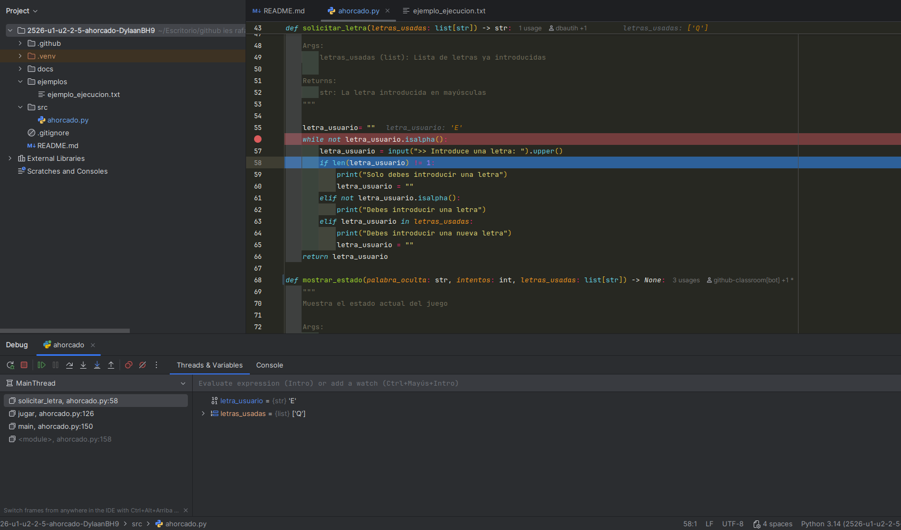

[](https://classroom.github.com/a/8lAzcOMh)
[](https://classroom.github.com/online_ide?assignment_repo_id=21506734&assignment_repo_type=AssignmentRepo)
# Práctica: El Juego del Ahorcado

## Descripción
El juego del "ahorcado" es un juego de lápiz y papel, en el que el objetivo es adivinar una palabra. Un jugador piensa una palabra y el otro jugador debe ir diciendo letras que cree que puede contener la palabra. Si acierta, se escriben todas las letras coincidentes. Si la letra no está, se resta un intento, agregando una parte al cuerpo (cabeza, brazo, etc.) hasta que queda dibujado todo el cuerpo del "ahorcado".

**Gana el juego** si se completa la palabra, y **se pierde** si se completa el número de intentos antes de completar la palabra.

En nuestra versión del ahorcado, no dibujaremos el cuerpo, sino que esta parte se simulará estableciendo un número de intentos, por ejemplo **5 intentos**.

## Objetivos de Aprendizaje
Esta práctica evalúa los siguientes conceptos:
- Variables y tipos de datos primitivos (int, float, bool) y String
- Sentencias condicionales (if, elif, else)
- Sentencias iterativas (while, for)
- Operadores lógicos y de comparación
- Manipulación básica de strings

## Requisitos del Programa

### 1. Lectura de la palabra a adivinar
- La palabra debe ser introducida por un jugador (posteriormente se ocultará para que el otro jugador no la vea)
- La palabra solo contendrá letras
- La palabra debe tener **mínimo 5 caracteres**
- Se convertirá a **mayúsculas** para evitar problemas con case sensitive

### 2. Lectura de las letras
- Solo se puede escribir **una letra** cada vez
- Solo se permiten **letras** (no números ni símbolos)
- Se convertirá a **mayúsculas** para evitar problemas con case sensitive

### 3. Lógica del juego
- Mostrar el estado de la palabra con guiones bajos (_) para las letras no adivinadas
- Mantener una **lista de letras usadas**
- Si una letra introducida:
  - **No está en la palabra** o **ya fue usada**: se resta un intento
  - **Está en la palabra** y **no fue usada**: se revelan todas las apariciones de esa letra
- El juego termina cuando:
  - Se adivina toda la palabra (GANA)
  - Se agotan los intentos (PIERDE)

## ¿Qué necesitamos?

### Estructuras de datos
- Una **lista** (o string) para guardar las letras usadas
- Una **variable string** para la palabra a adivinar
- Una **variable string** para el estado actual de la palabra (con _ y letras adivinadas)
- Una **variable int** para contar los intentos restantes

### Operaciones con Strings
Funciones útiles de Python para strings:
- `upper()` - Convertir a mayúsculas
- `lower()` - Convertir a minúsculas
- `replace()` - Reemplazar caracteres
- `in` - Verificar si un carácter está en un string
- `len()` - Obtener la longitud
- `isalpha()` - Verificar si es una letra
- `index()` o `find()` - Encontrar la posición de un carácter

### Operaciones con Listas
- `[]` - Crear lista vacía
- `append()` - Añadir elemento a la lista
- `in` - Verificar si un elemento está en la lista

### Bucles necesarios
- **While**: Para solicitar la palabra hasta que cumpla las condiciones
- **While**: Para el bucle principal del juego (mientras haya intentos y no se haya ganado)
- **For**: Para recorrer la palabra y reemplazar las letras adivinadas

## Metodología de Trabajo

1. **Dividirse en grupos** (si procede)
2. **Pensar y planificar** cómo resolver el problema
3. **Identificar herramientas** necesarias
4. **Implementar la solución** paso a paso
5. **Probar y depurar** el código

## Estructura del Proyecto

```
2526_PRO_u2_ahorcado/
│
├── README.md                 # Este archivo
├── src/
│   └── ahorcado.py          # Archivo principal del juego
├── docs/
│   └── planificacion.md     # Documento de planificación (opcional)
└── ejemplos/
    └── ejemplo_ejecucion.txt # Ejemplo de cómo debería funcionar
```

## Ejemplo de Ejecución

```
=== JUEGO DEL AHORCADO ===

Jugador 1: Introduce la palabra a adivinar (mínimo 5 letras): 
> PYTHON

[Limpiando pantalla...]

Jugador 2: ¡Adivina la palabra!

Intentos restantes: 5
Palabra: _ _ _ _ _ _
Letras usadas: []

Introduce una letra: A
¡Letra incorrecta!

Intentos restantes: 4
Palabra: _ _ _ _ _ _
Letras usadas: ['A']

Introduce una letra: P
¡Bien! La letra P está en la palabra.

Intentos restantes: 4
Palabra: P _ _ _ _ _
Letras usadas: ['A', 'P']

Introduce una letra: Y
¡Bien! La letra Y está en la palabra.

Intentos restantes: 4
Palabra: P Y _ _ _ _
Letras usadas: ['A', 'P', 'Y']

[...]

¡FELICIDADES! Has adivinado la palabra: PYTHON
```

## Notas Importantes

- **NO** es necesario terminar la solución completamente
- Se proporcionará una solución propuesta para discutir en clase
- El objetivo es **practicar y aprender**, no completar perfectamente
- Se valorará el **proceso de pensamiento** y la **planificación**

## Recursos de Referencia

- [Documentación oficial de Python sobre strings](https://docs.python.org/3/library/stdtypes.html#str)
- [revilofe.github.io - Recursos de programación](https://revilofe.github.io/)
- [Tutoriales de Python en W3Schools](https://www.w3schools.com/python/)

## Autor
Profesor: revilofe

## Licencia
Material educativo para uso académico

## Ejemplo de uso del debugger de Pycharm
### Cómo encontré el fallo con el depurador

Me di cuenta de que el juego tenía un fallo: podía poner la misma letra incorrecta muchas veces y el programa no me avisaba. Yo creía que el problema era que la lista `letras_usadas` no se estaba guardando bien después de cada turno.

Para comprobarlo, usé el depurador de mi editor de esta manera:

1.  **Puse un punto de interrupción (breakpoint)** en la **línea 139**. Este es el sitio donde empieza cada turno, así que era perfecto para mirar qué estaba pasando con las variables.

2.  **Empecé a depurar.** La primera vez que el programa se paró, me fijé en la variable `letras_usadas`. Estaba vacía `[]`, lo cual era normal al empezar.

3.  **Le di a continuar** y jugué el primer turno.

4.  El programa se paró otra vez en el mismo sitio. Miré de nuevo la variable `letras_usadas` y vi que **seguía vacía**. ¡Ahí estaba la prueba! La lista no se estaba actualizando.

Al mirar las líneas de código justo después del punto de interrupción, vi que faltaba la línea `letras_usadas.append(letra)`.


## Explicacion de la documentacion
El código cuenta con la documentación estaba escrita en un estilo diferente (la de Google). Como pediste un cambio de tipo de documentacion, **cambié todo el estilo al de NumPy/SciPy**, que es el que se ve ahora.

Un ejemplo del estilo NumPy/SciPy que he usado es este:

https://github.com/IES-Rafael-Alberti/2526-u1-u2-2-5-ahorcado-DylaanBH9/blob/66c5ed1900d798bb0b62c593bd546249c0f887d9/src/ahorcado.py#L109-L124

Lo más importante, como dice la teoría, es **elegir un estilo y usar siempre el mismo** en todo el proyecto.

